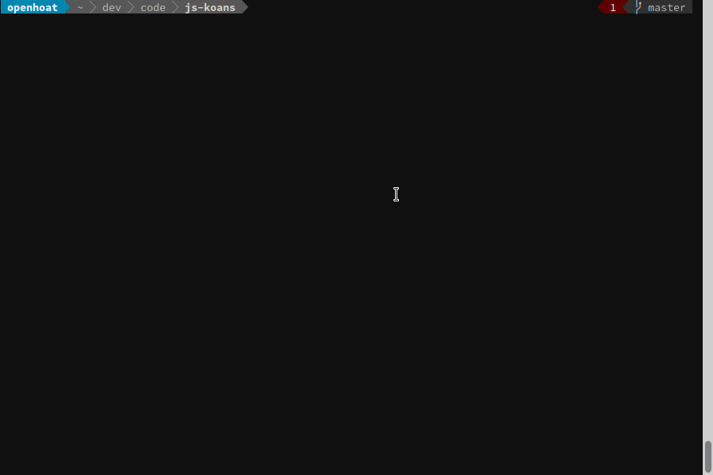
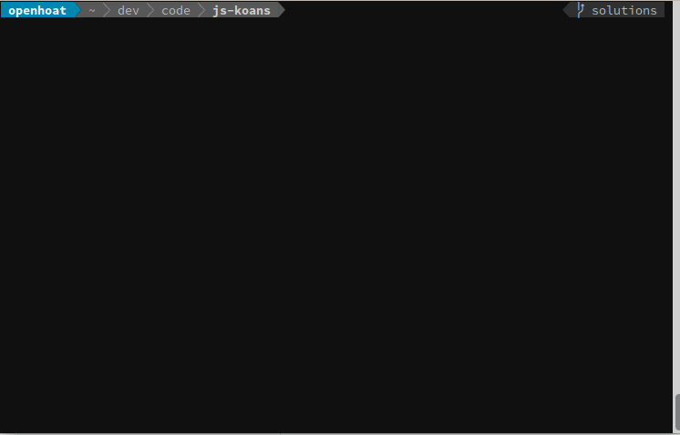

# JavaScript Koans

The goal of this project is to improve skills of JavaScript programmers.

It mainly contains some tests that describe some problems to solve and make assertions to check if the component behaves correctly.

The way it works is very simple, all you have to do is to solve the failing tests.

## Story

Go from :



To :



## Usage

### Prerequisite

```shell
$ npm i
```

### Play with tests

Validate linting and tests:

```shell
$ npm run validate
```

Or simply execute tests:

```shell
$ npm test
```

Other scripts:

- build : transpile the sources from ./src to ./built directory
- clean : clean the ./built and ./dist directories
- lint : run linter
- prettier : check sources format
- test : run the tests
- test:watch : run the tests in watch mode
- validate : validate the main sources with linter and tests

## More information

- Jest is used to implement and run the tests.
- Babel is used seamlessly to support es2020

## Tips and tricks

### Execute a subset of tests

The test sources have group tags decorations, so you can execute tests that match a specific tag.

Examples:

- execute tests of group "easy" and "sync"

  ```shell
  $ npm test -- --group=easy --group=sync
  ```

- execute only the "factorial" test

  ```shell
  $ npm test -- --group=sync -t="factorial"
  ```

- execute only the "supereasy" tests, showing each test usecase

  ```shell
  $ npm test -- --group=supereasy --verbose
  ```
